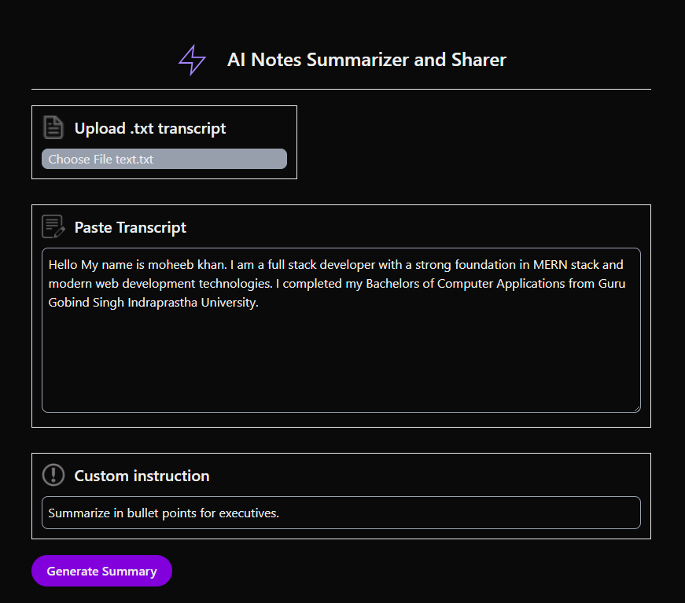
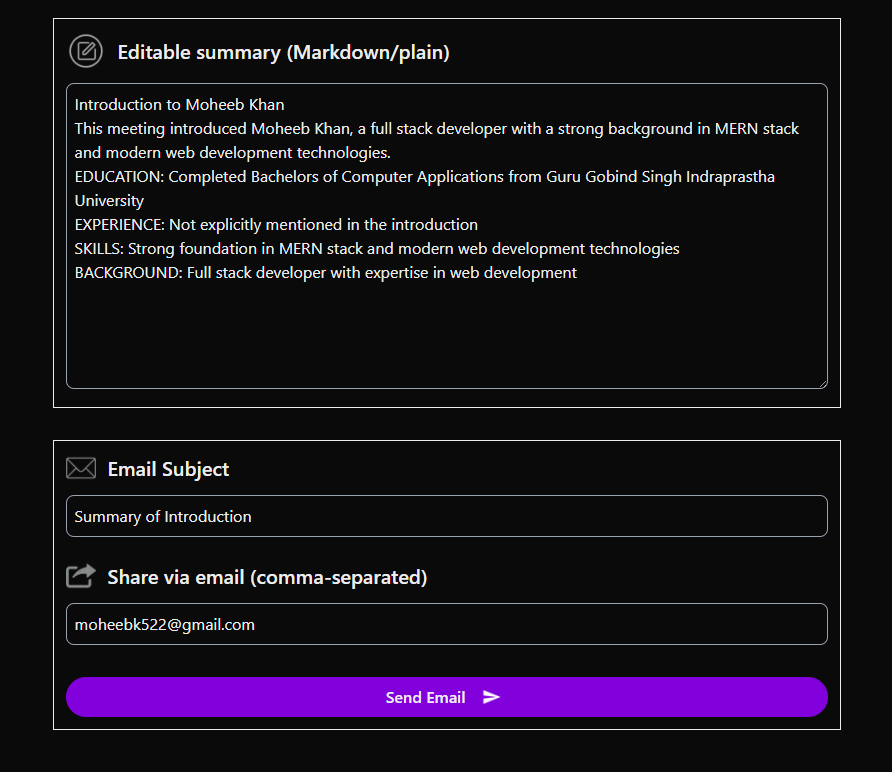

# 📝 AI Notes Summarizer & Sharer

A minimal Next.js full-stack app to:
- Upload/paste a meeting/call transcript
- Add a custom instruction (e.g., “Highlight only action items with owners and due dates”)
- Generate an AI summary
- Edit the result
- Share via email (SMTP) using Brevo + Nodemailer
- Create a personal link to share, work and stores data

---

## ✨ Features

- **🧠 AI Summaries** – Uses Groq models for fast, structured summaries
- **🧾 Custom Instructions** – Prompt the AI (executive bullets, action items, risks, etc.)
- **✏️ Editable Output** – Tweak the generated text before sending
- **📧 Email Sharing** – Send the final summary via Brevo SMTP (Nodemailer)
- **📧 Link Sharing** – Send personal link to collaborate with others
- **🧩 Optional Persistence** – (Optional) Save/fetch summaries via MongoDB for shareable links
- **🔒 Input Validation** – Zod validation on API routes
- **🧹 Super Basic UI** – Focus on functionality, not design

---

## 🛠️ Tech Stack

- **Frontend:** Next.js (App Router), TypeScript
- **Styling:** Tailwind CSS
- **AI Tool:** Groq (llama-3.3-70b-versatile or another supported model)
- **Email:** Nodemailer + Brevo SMTP
- **Validation:** Zod
- **DB:** MongoDB Local / Atlas (Mongoose)
- **Deploy:** Vercel

---

## 📦 Installation Instructions

### 1️⃣ Clone & Install

```bash
git clone https://github.com/moheebk123/Notes-Summarizer-and-Sharer
cd Notes-Summarizer-and-Sharer
npm install
```

### 2️⃣ Setup Environment Variables

Create a <b>.env.local</b> file in the root with:

```bash
# --- AI (Groq) ---
GROQ_API_KEY=your_groq_key
GROQ_MODEL=llama-3.3-70b-versatile

# --- Email (Brevo SMTP) ---
BREVO_SMTP_HOST=smtp-relay.brevo.com
BREVO_SMTP_PORT=587
BREVO_SMTP_USER=your_brevo_api_key_or_username
BREVO_SMTP_PASS=your_brevo_smtp_password
BREVO_SENDER_EMAIL=you@example.com
BREVO_SENDER_NAME=Your Name

# --- DB ---
MONGODB_URI=your_mongodb_uri
MONGODB_DATABASE_NAME=your_mongodb_database_name

# --- Next App URL ---
NEXT_PUBLIC_APP_URL=http://localhost:3000

```

### 4️⃣ Start Development Server

```bash
npm run dev
```
The app will be accessible at [http://localhost:5173](http://localhost:5173)

---

## 🚀 Usage

1. Upload a .txt transcript or paste raw text
2. Enter a custom instruction (e.g., “Summarize in 6 bullets for execs”)
3. Click Generate Summary → editable text appears
4. Edit if needed
5. Enter recipient emails (comma-separated) and click Send Email
6. Click Create Link → unique link for sharing
7. Click on Link Box or Link Text to navigate to personal summarizer
8. Open Link, Change Prompt/Transcript/Summary
9. Click Update → data updated

## Sample Prompts

- Summarize in short, crisp bullets for executives; include KPIs only.
- Action items with owners and due dates; exclude small talk.
- Decisions, risks, and next steps.
- Create a client-ready email with key takeaways.

---

## 🌐 Live Demo

[https://notes-summarizer-and-sharer.vercel.app](https://notes-summarizer-and-sharer.vercel.app)

---

## 📷 Screenshot




---

## 📂 Project Structure

```plaintext
note-summarizer/
│── app/
│   ├── page.tsx                      # Minimal UI
│   └── api/
│       ├── summarize/route.ts        # AI summarize endpoint (Groq)
│       ├── share/route.ts               # Email via Brevo + Nodemailer
│       └── save/route.ts                # store summary data (Mongo)
│       └── update/route.ts            # update summary data (Mongo)
│── lib/
│   ├── groq.ts                       # Groq client + summarize helper
│   └── db.ts                         # Mongo connection + model
│── public/
│   ├── logo.svg                      # App logo (used in header)
│   ├── _icon_name_.png        # Icon Images (used all over the app)
├── .env.local                         # Local env vars (gitignored)
├── next.config.js
├── package.json
└── README.md
```

---

## 🔌 API Endpoints

### 1️⃣ POST /api/summarize

**Body**:
```bash
{
  "transcript": "string (required)",
  "prompt": "string (required)"
}
```

**Response**:
```bash
{ "summary": "string" }
```
**System Instruction (example):**
- Use a heading (plain text), one-line summary, then key points in "Category: Description" lines. No Markdown. Example:

```bash
Client Review Call
Discussed timelines, blockers, and next steps.
Education: Completed BCA from GGSIPU
Next Steps: Share updated roadmap by Friday
Risks: API rate limits may affect reporting
```

### 2️⃣ POST /api/share

**Body**:
```bash
{
  "summary": "string (required)",
  "recipients": ["a@example.com", "b@example.com"],
  "subject": "Meeting Summary"
}
```

**Response**:
```bash
{
  "ok": true,
  "id": "<message-id>"
}
```
**Note:**
- Uses Brevo SMTP via Nodemailer. HTML is sanitized with a simple escape helper.


### 1️⃣ POST /api/save

**Body**:
```bash
{
  "prompt": "string (required)",
  "transcript": "string (required)",
  "summary": "string (required)"
}
```

**Response**:
```bash
{
  "link": "string"
}
```
**Shareable Link**


### 1️⃣ POST /api/update

**Body**:
```bash
{
  "id": "string (required)",
  "prompt": "string",
  "transcript": "string",
  "summary": "string"
}
```

**Response**:
```bash
{
  "ok": true,
  "doc": "object(_id, transcript, prompt, summary, createdAt, updatedAt )"
}
```

---

## 🛡️ Security & Limits
- Validate inputs with Zod (already in routes)
- Escape HTML before sending emails
- Add a max transcript size (e.g., 50–100 KB) to control token costs
- Never expose secrets to the client (only use server-side env vars)
- (Optional) Add rate limiting for /api/summarize and /api/share

---

## 👨‍💻 Author

Developed with 💙 by [Moheeb Khan](https://github.com/moheebk123)

---

> For any queries or issues, feel free to raise an issue or contact via GitHub.
